# Line 31

### **Indice**
- [**Introdução**](#introducao)
- [**Trabalho Realizado**](#trabalho-realizado)
   - [***Classificação***](#Classificação)
        - [Estação 10 ](#estacao-10)
        - [Estação 20 ](#estacao-20)
        - [Estação 30 ](#estacao-30) 
        - [Estação 40 ](#estacao-40)
        - [Estação 50 ](#estacao-50)
   - [***Grafcets***](#grafcets)
        - [Estação 10 Grafcet ](#estação-10-Grafcet)
        - [Estação 20 Grafcet ](#estação-20-Grafcet)
        - [Estação 30 Grafcet ](#estação-30-Grafcet) 
        - [Estação 40 Grafcet ](#estação-40-Grafcet)
        - [Estação 50 Grafcet ](#estação-50-Grafcet)     
   - [***Fluxograma***](#Fluxograma)
   - [***Processo***](#Processo)
        - [***Comunicações Profinet***](#Comunicações-Profinet)
        - [***Programação de servo no TIA Portal***](#Programação-de-servo-no-TIA-Portal)
   - [***HMI(Human-Machine Interface)***](#HMI-(Human-Machine-Interface))  
   - [***Manual***](#Manual)
        - [**Fluxograma**](#Fluxograma)
          - [Conceito ](#Conceito)
          - [Simbologia ](#Simbologia)  
          - [Criar um Fluxograma ](#Criar-um-Fluxograma)
        - [**Texto Estruturado** ](#Texto-Estruturado)
          - [Passos ](#Passos)
        
   
### Introdução

A Line 31 é uma das Lines do Grupo 30. Dividida em 5 estações das quais resultam: **"Transporte"**,**"Pressurização"**, **"Alimentação (Corpo e Miolo)"** e **"Seleção"**.
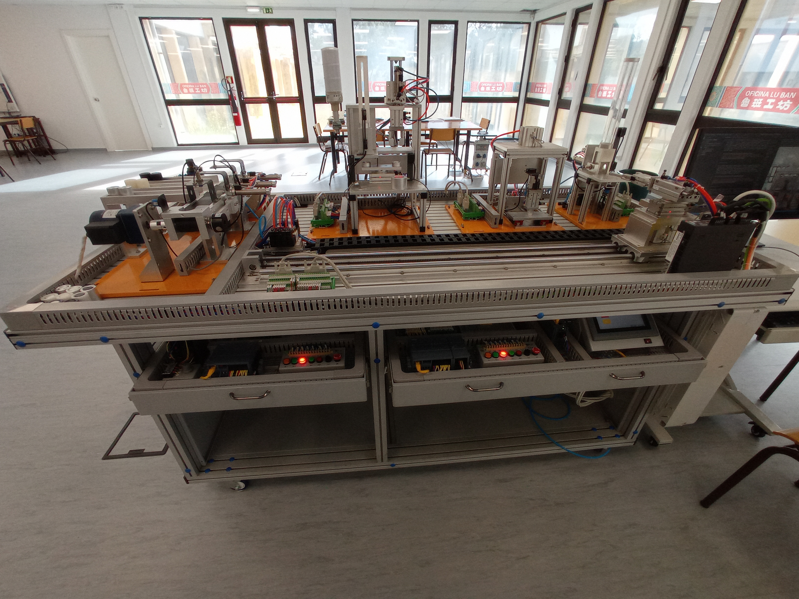
  

### Trabalho Realizado
#### **Classificação**
  

#### Estação 10 

| Tags                      | Inputs  | Legend                      | Tags             |	Outputs  | Legend    |
------------------------- | ------- | ---------------------------- | ---------------- | -------- | --------- 
|Axis_1_Homing_switch     |I0.0  |                           |Axis_1_Pulse    |Q0.0    ||
|Axis_1_HighHw_LimitSwitch|I0.1  |Fim de Curso(Frente)       |Axis_1_Direction|Q0.1    ||
|Axis_1_LowHw_LimitSwitch |I0.2  |Fim de Curso(Tras)         |3110Y10         |Q0.3    |Cilindro Vertical|	
|311010B10                |I0.3  |Sensor de Movimento(Baixo) |3110Y20A        |Q0.4    |Cilindro Rotacional(Esquerda)|	
|311010B11                |I0.4  |Sensor de Movimento(Cima)  |3110Y20B        |Q0.5    |Cilindro Rotacional(Direita)|	
|311020B20                |I0.5  |Sensor de Rotacao(Esquerda)|3110Y30         |Q0.6    |Cilindro Horizontal|	
|311020B21                |I0.6  |Sensor de Rotacao(Direita) |3110GA          |Q0.7    |Fechar Garra|	
|311030B10                |I0.7  |Sensor de Posicao Avancada |3110GB          |Q1.0    |Abrir Garra|	
|311030B11                |I1.0  |Sensor de Posicao Recuada  |31192011        |Q8.5    |Luz Laranja|
|3110G10                  |I1.1  |Sensor de Garra            |31192012        |Q8.6    |Luz Verde|	
|311920SB2                |I8.4  |Stop                       |31192013        |Q8.7    |Luz Vermelha|	
|311920SB1                |I8.5  |Start                      ||			   	   	           
|311920QS                 |I8.6  |Switch de Emergência       ||			   	               
|311920SA                 |I8.7  |Switch ON/OFF              ||                                                
  

#### Estação 20 	

|Tags   |Inputs|	Legend          |		Tags|	Outputs|	Legend       |
|-------|------|--------------------|-----------|----------|-----------------|
|3120B21|I0.0  |Sensor de frente	|3120Y20    |Q0.0	   |Cilindro Superior|	
|3120B22|I0.1  |Sensor de Trás	    |3120Y10    |Q0.1	   |Cilindro Inferior|	
|3120B11|I0.2  |Sensor de Frente	|292011	    |Q0.7	   |Luz Laranja|	
|3120B12|I0.3  |Sensor de Trás	    |292012	    |Q1.0	   |Luz Verde|	
|3120B40|I0.4  |Sensor Base		    |292013	    |Q1.1	   |Luz Vermelha|	
|3120B31|I0.5  |Sensor de Cima(Tubo)					
|3120B32|I0.6  |Sensor de Baixo(Tubo)					
|3120B33|I0.7  |Sensor Metálico(Tubo)					
|3129SB2|I1.2  |Stop					
|3129SB1|I1.3  |Start					
|3129QS	|I1.4  |Switch de Emergência					
|3120SA	|I1.5  |Switch ON/OFF					
  

#### Estação 30

|Tags	|Inputs|Legend		            |Tags  |Outputs|Lengend|
-------|--------|------------------------|------|-------|------------
|3130B21|I0.0	|Sensor Garra		      |3130Y20|Q0.0	  |Garra        |	
|3130B22|I0.1	|Sensor Garra Fechada     |3130Y10|Q0.2	  |Base         |	
|3130B11|I0.2	|Sensor de Trás (Base)    |3130Y30|Q0.3	  |Prensa       |	
|3130B12|I0.3	|Sensor de Frente(Base)   |392011 |Q0.7	  |Luz Laranja  |	
|3130B31|I0.4	|Sensor de Pos.Rec(Prensa)|392012 |Q1.0	  |Luz Verde    |	
|3130B32|I0.5	|Sensor de Pos.Av(Prensa) |392013 |Q1.1	  |Luz Vermelha |	
|3139SB2|I1.2	|Stop				 |	
|3139SB1|I1.3	|Start				 |	
|3139QS	|I1.4	|Switch de Emergência|					
|3139SA	|I1.5	|Switch ON/OFF       |
  

#### Estação 40

|Tags	   |Inputs|Legend		           |Tags	  |Outputs|Legend	       |
|-----------|------|------------------------|----------|-------|----------------|
|314020B11 |I0.0  |Sensor Tubo em cima     |314020Y10 |	Q0.0  |Cilindro Baixo do Tubo|	
|314020B10 |I0.1  |Sensor Tubo em baixo    |314020Y20 |	Q0.1  |Cilindro Cima do Tubo|	
|314010B31 |I0.2  |Sensor Prato lado Esq.  |314010R10 |	Q0.2  |Prato	        |
|314010B30 |I0.3  |Sensor Prato lado Dir.  |314030G10 |	Q0.3  |Garra           	|
|314010B10 |I0.4  |Sensor Tubo	           |314030Y20 |	Q0.4  |Cilindro Vertical|	
|314020B21 |I0.5  |Sensor á Frente         |314030Y10 |	Q0.5  |Cilindro         Horizontal|	
|314020B20 |I0.6  |Sensor a trás           |314040HL10|	Q0.6  |Semáforo Encarnado|	
|314020B30 |I0.7  |Sensor á Frente         |314040HL20|	Q0.7  |Semáforo Laranja	 |
|314020B31 |I1.0  |Sendor a trás           |314040HL30|	Q1.0  |Semáforo Verde	 |
|314010B20 |I1.1  |Sensor posição inicial  |4920HL1   |	Q8.5  |Luz Laranja	     |
|314030B21 |I1.2  |Sensor Mov.(Prato)      |4920HL2   |	Q8.6  |Luz Verde	     |
|314030B10 |I1.3  |Sensor Garra            |4920HL3   |	Q8.7  |Luz Vermelha	     |
|314930B41 |I1.4  |Sensor de Garra em baixo|					
|314030B40 |I1.5  |Sensor de Garra em cima |					
|314030B51 |I8.0  |Sensor de Trás          |					
|314030B50 |I8.1  |Sensor de Frente        |					
|3149SB1   |I8.5  |Start                   |					
|3149QS    |I8.6  |Switch de Emerg.        |					
|3149SA    |I8.7  |Switch ON/OFF           |
  

#### Estação 50

|Tags	|Inputs	|Legend		       |Tags	|Outputs|Legend|
--------|-------|------------------|------- |-------|--------------
|       |I0.0	|Encoder(Fase A)   |Tapete	|Q0.0	|Motor (Rotação Avancada)|
|       |I0.1	|Encoder(Fase B)   |Tapete	|Q0.1	|Motor (Rotação Recuada) |	
|       |I0.2	|Encoder(Fase C)   |3150Y20	|Q0.4	|Cilindro 1|
|3150B11|I0.3	|Sensor de Material|3150Y30	|Q0.5	|Cilindro 2|
|3150B12|I0.4	|Sensor de Metálico|3150Y40	|Q0.6	|Cilindro 3|	
|3150B13|I0.5	|Sensor Otico      |592011  |Q0.7   |Luz Amarela |
|3150B21|I0.7   |Sensor(Cilindro 1)|592012  |Q1.0   |Luz Verde  |
|3150B31|I1.0   |Sensor(Cilindro 2)|592013  |Q1.1   |Luz Laranja|
|3150B41|I1.1   |Sensor(Cilindro 3)|
|3159SB2|I1.2	|Stop              |					
|3159SB1|I1.3	|Start	           |				
|3159QS	|I1.4	|Switch de Emerg.  |					
|3159SA	|I1.5	|Switch ON/OFF	   |
  

#### Fluxograma

##### Estação 50

|Individual|Junções|		
--- | --- 
Corpo Preto|Corpo Branco + Miolo Branco = 11			
Corpo Branco|Corpo Branco + Miolo Preto = 3		
Miolo Preto|Corpo Branco + Miolo Metálico = 15			
Miolo Branco|Corpo Preto + Miolo Branco = 9		
Corpo Plástico|Corpo Preto + Miolo Preto = 1		
Corpo Metálico|Corpo Preto + Miolo Metálico = 13			
Miolo Plástico|Corpo Metálico + Miolo Branco = 12 			
Miolo Metálico|Corpo Metálico + Miolo Preto = 4			
||Corpo Metálico + Miolo Metálico = 16 		
  

### **Grafcets** 
#### Estação 10 

  

#### Estação 20

  

#### Estação 30

  

#### Estação 40

  

##### Estação 50
  

##### Com Rejeicao

  

##### Sem rejeicao

  

#### **Fluxograma**
  

##### Estação 50
###### Fluxograma Inteiro
.svg)
  

###### Fluxograma por Partes
.svg)
  

#### Texto Estruturado
(* Testa corpo PosB13*)

    IF #Posicao = #PosB13a THEN
        IF #B13 THEN
            #CorpoB13 := #Corpo_B;
        ELSE
            #CorpoB13 := #Corpo_P;
        END_IF;
    END_IF;

(* Testa miolo PosB13*)

    IF #Posicao = #PosB13b THEN 
       IF #B13 THEN
           #MioloB13 := #Miolo_B;
       ELSE
           #MioloB13 := #Miolo_P;
       END_IF;
    END_IF;
        
(* Testa corpo PosB12*)

    IF #Posicao = #PosB12a THEN
       IF #B12 THEN
           #CorpoB12 := #Corpo_M;
       ELSE
           #CorpoB12 := #Corpo_PL;
       END_IF;
    END_IF;

(* Testa miolo PosB12*)

    IF #Posicao = #PosB12b THEN
       IF #B12 THEN
           #MioloB12 := #Miolo_M;
       ELSE
           #MioloB12 := #Miolo_PL;
       END_IF;
    END_IF;

(*Funcao Principal*)

(*Corpo Metalico*)

    IF #CorpoB13 = #Corpo_B THEN
         IF #CorpoB12 = #Corpo_M THEN
            IF #MioloB13 = #Miolo_P THEN
            #Classificacao := 4;
            ELSE
                IF #MioloB13 = #Miolo_B THEN
                   IF #MioloB12 = #Miolo_M THEN
                    #Classificacao := 16;
                   ELSE
                       IF #MioloB12 = #Miolo_PL THEN
                           #Classificacao := 12;
                    END_IF;
               END_IF;
          END_IF;
    END_IF;
(*Corpo Branco*)

    ELSE

        IF #MioloB13 = #Miolo_P THEN
            #Classificacao := 3;
        ELSIF #MioloB13 = #Miolo_B THEN
            IF #MioloB12 = #Miolo_M THEN
                #Classificacao := 15;
            ELSIF #MioloB12 = #Miolo_PL THEN
                #Classificacao := 11;
            END_IF;
        END_IF;
    END_IF;
(*Corpo Preto*)

 ***ELSE***

    IF #CorpoB13 = #Corpo_P THEN
        IF #MioloB13 = #Miolo_P THEN
            #Classificacao := 1;
        ELSIF #MioloB13 = #Miolo_B THEN
            IF #MioloB12 = #Miolo_M THEN
                #Classificacao := 13;
            ELSIF #MioloB12 = #Miolo_PL THEN
                #Classificacao := 9;
            END_IF;
        END_IF;
    END_IF;
***END_IF;***
  
  

### **Processo**
  

#### Foto Peça

  

#### Estação 10
A estação 10 têm como objetivo o transporte do "corpo" e "miolo" ao longo da *Line 31*. Para esse transporte acontecer ter-se-á que fazer um grafcet (mencionado acima) e um ladder.
Esta estação é controlada por um servo motor que na qual movimenta o apelidado de "Carro". Estes movimentos são feitos através de um *Motion Control*.Basicamente para o "Carro" movimentar-se, tive que criar em primeiro lugar um *MC_MoveAbsolute* e comunicar que a **posição** com o valor **0.0** destinava-se ao inicio do ciclo que o "Carro" irá fazer,mais resumidamente *Posição_HOME*.Com esta posição o carro está apto para iniciar o seu ciclo, que irá começar nesta posição, fazendo a comunicação, chamada de *PROFINET* com a **Estação 20**.Esta comunicação é muito importante , pois irá "dizer" a que momento o nosso"carro" pode avançar ou não para a estação seguinte. Se a *estação 20* tiver completo o seu processo iremos então criar novamente um *MC_MoveAbsolute* com a posição suficiente para comunicar com a *estação 30* (Valor=**287.2048**), quando a *estação 30* tiver feito o seu processo o "carro" vai avançar para a *estação 40* até á posição com o valor igual a **776.1536**, *estação 40* efetua o seu processo e de seguida o carro transporta a nossa peça(Corpo e miolo) até à posição **1051.882**, de seguida o "carro" volta para a sua posição inicial através de um *MC_Home* que têm o valor **0.0** onde iniciará um novo ciclo.

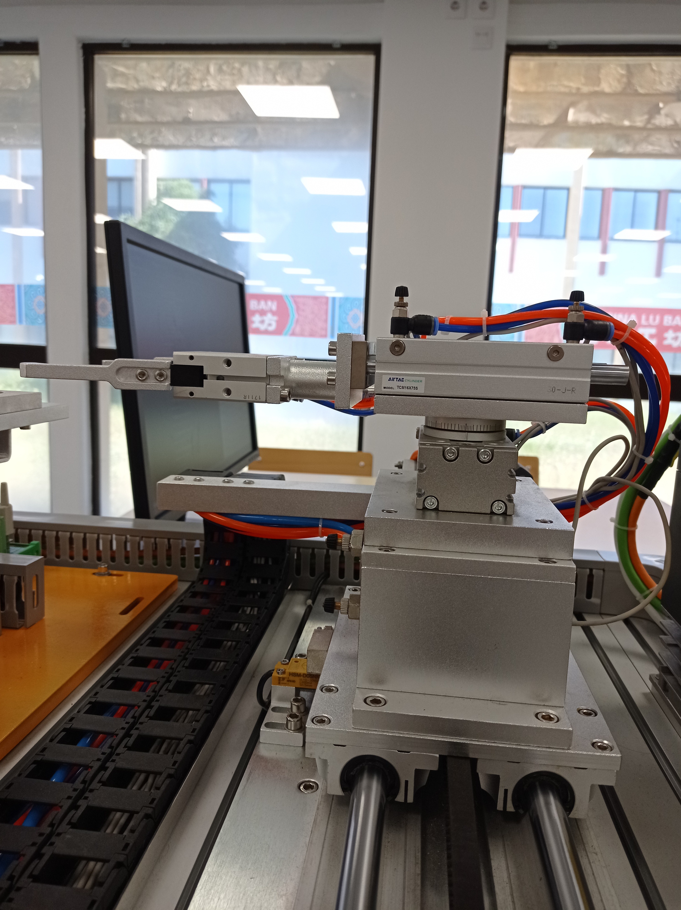

#### Estação 20
A estação 20, é a estação onde se identifica e coloca-se manualmente o "corpo" através de um tubo. Chegando ao fim do tubo, o nosso "Corpo" irá ser "orientado" através de um cilindro, cilindro este que só se movimenta,porque um sensor colocado no fim do tubo detetou algo. Após a detecção do nosso "corpo" chegar ao fim do tubo, o cilindro então irá movimentar-se para a frente onde o irá guiar até que ele seja agarrado pela garra que o nosso "carro" contêm.

  

#### Estação 30
A estação 30 da *Line 31* têm como objetivo a verificação de alguma anormalidade. Resumidamente o "corpo" é "largado" na garra, esta garra contêm um sensor, que após 1s deteta e a garra fecha, e de seguida a base movimenta-se para trás, onde a meio desse movimento, teremos uma prensa que verificará se temos algum objeto no interior do nosso "corpo". Não tendo nada no interior a base irá então voltar a posição inicial e abrir a garra para que o nosso corpo seja encaminhado para a proxima estação.

  

#### Estação 40

Na estação 40 temos então o seguinte processo: Coloca-se manualmente o miolo num tubo que irá ser encaminhado até um "prato" que irá rodar 180 graus estando ao mesmo nivel da garra.Esta garra têm como objetivo a colocação do "miolo" no interior do nosso "corpo" completando assim a nossa peça. O nosso corpo estará numa base que contêm um sensor e é então a partir dai que o nosso "carro" recebe o sinal de conclusão do processo da estação 40.

  

#### Estação 50

A estação 50, a última estação de um ciclo, têm como objetivo a divisão das peças, pois temos varias junções de "corpos" e "miolos".Esta divisão é feita através da marcação de posições de um encoder e também da detecção de sensores, e claro por um cilindro que irá guiar a peça até à sua secção.

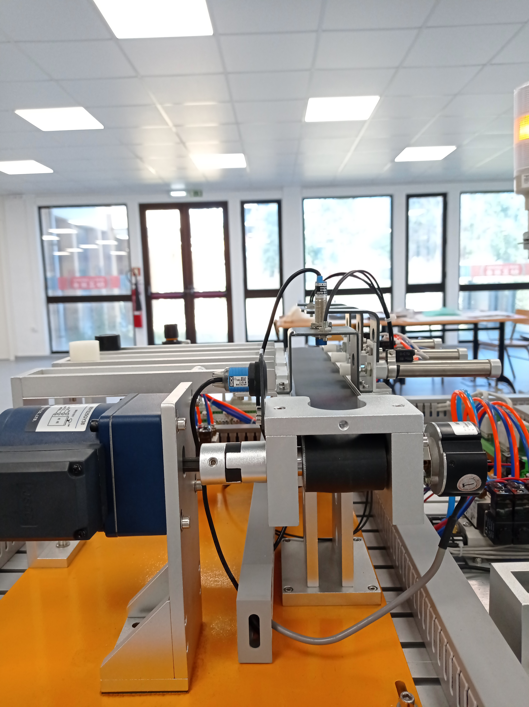

  

#### ***Comunicações Profinet***
O PROFINET é um protocolo baseado em Ethernet para conectar dispositivos de processo – sensores, atuadores etc – aos sistemas de controlo.
  

***Memórias-Profinet***

*PLC 29*

**Inputs:**

 IDW100 <------ QDW101
  

**Outputs:**

QDW100 ------> IDW100
  

---------------------------
*PLC 39*

**Inputs:**

 IDW104 <------ QDW104
  

**Outputs:**

QDW104 ------> IDW104
  

------------------------
*PLC 49*

**Inputs:**

 IDW106 <------ QDW105
  

**Outputs:**

QDW105 ------> IDW106
  

#### **Programação de servo no TIA Portal**
Para programação de um servo o TIA Portal disponibiliza um conjunto de blocos  (sub-rotinas)  de  controlo  de  movimento  (Motion  Control)  que  permitem integrar de forma fácil e prático o servo ao programa.
  
  

O bloco *MC_Power*, é responsavel por alimentar/ligar o servo, sem este estar ligado, nao sera possivel executar nenhum movimento.

  
 O bloco *MC_Home* é responsável por calibrar a posição **Home** levando o servo até ao sensor de *Homing* configurado e de seguida atribui a essa posição um valor absoluto que pode ser configurado na variável *Position*.

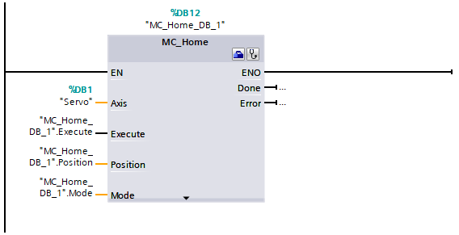
  
O bloco *MC_MoveJog* permite mover o servo nos dois sentidos (frente e trás) apenas enviando sinais para a entrada própria do sentido em que se pretende mover o servo. Se executarmos o *Jog_Forward* o servo ira movimentar-se para a frente, se executarmos o *Jog_Backward* o servo ira movimentar-se para tras.

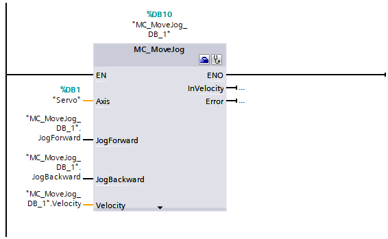
  
O bloco *MC_MoveAbsolute* é responsável por mover o servo até uma coordenada absoluta, independentemente da atual coordenada.

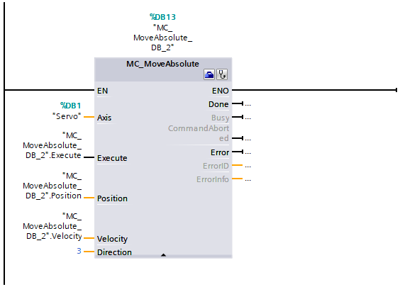
  
O bloco *MC_MoveRelative* é responsável por mover o servo a uma determinada distancia de coordenadas a partir da coordenada atual do servo.

  
 O bloco *MC_Halt* permite ao programa parar movimentos do servo antes do mesmo os concluir.

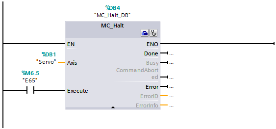
  
O bloco *MC_Reset* confirma uma mensagem de erro. A memória de erro é apagada para que fique disponível para "novas mensagens" de erro.

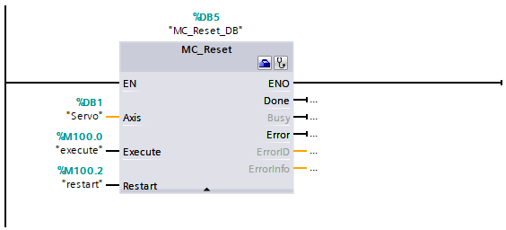

  

####  **Funcionamento Completo do Processo**

  

### **HMI(Human-Machine Interface)**
**HMI** significa interface homem-máquina e consiste em um painel que permite um utilizador comunicar com uma máquina, um programa de computador ou um sistema.
Em um ambiente industrial, uma HMI pode ter vários formatos. Ela pode ser um ecra independente, um painel conectado a outro equipamento ou um tablet. Seja qual for sua aparência, sua principal finalidade é permitir aos usuários visualizarem dados sobre operações e controlarem o equipamento.
  
Na **HMI** configurada por mim, iremos ter 9 ecras.Um deles sera o ecra inicial (Root Screen), que tera conexao com 5 ecras que tem o objetivo e a finalidade de comandar cada cilindro de cada estacao, com 2 ecras que tem o objetivo de fazer testes e movimentar a estacao 19 e por fim um ecra que tera objetivo de se tornar mais facil a utilizacao da **HMI** utilizando assim 5 botoes com connecao para cada PLC.
  

*Imagem 1 - HMI*
  
Na imagem 1 e 2, observa-se o ecra principal (Root Screen) da **HMI**. Este ecra tem como objetivo direcionar o utilizador para os outros ecras. Como se pode observar, existem 3 icones a cinzento, numa barra inferior em que o utilizador basta pressionar e este troca de vista. 
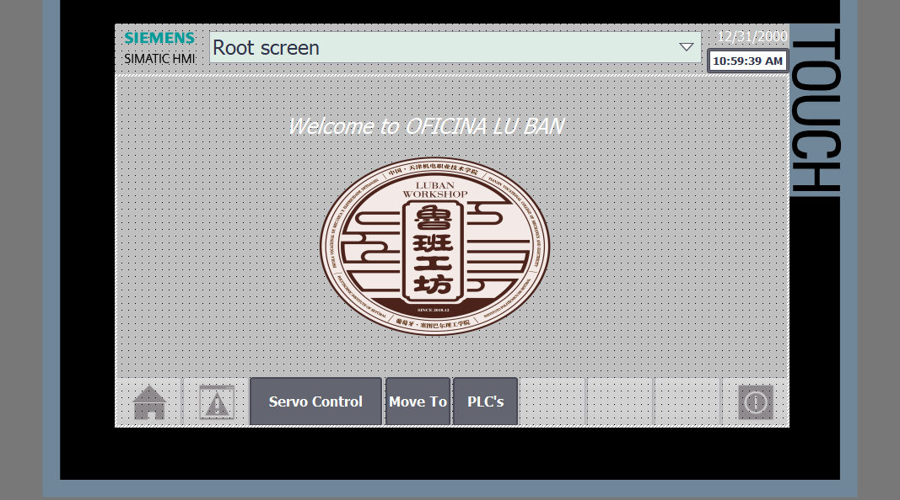
*Imagem 2 - TIA Portal*
  
  

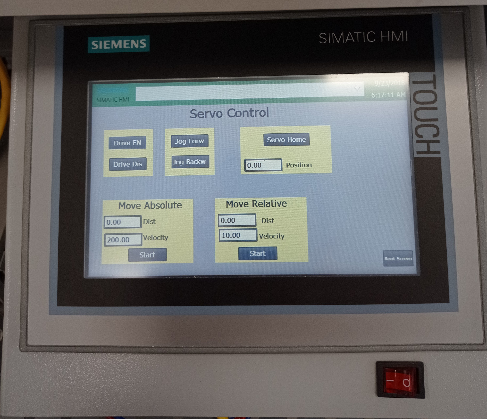
*Imagem 3 - HMI*
  
Nas imagens 3 e 4 podemos observar que contem 5 blocos, todos eles com o objetivo de fazer movimentar a nosso robo pneumatico. No 1°bloco temos 2 icones que estão associados ao MC_Power, através do seu *Data Block*, fazendo o Enable e o Disable da estação. No 2°bloco temos 2 icones que estão associados ao MC_MoveJog, através do seu *Data Block*, fazendo com que, se o utilizador mantiver pressionado um desses icones, o robo pneumatico irà  movimentar-se lateralmente ,se pressionar o icone com o nome *Jog Forw*  o robo pneumatico irà movimentar-se para a esquerda, se pressionar o icone com o nome *Jog Backw* ele irà  movimentar-se para direita. No 3°bloco, temos 1 icone e 1 amostrador ,que estão associados ao MC_Home, através do seu *Data Block*. Se o utilizador pressionar o icone que têm o nome de Servo Home, o robo pneumatico ira movimentar-se para a posicão *HOME*, ou seja posicão 0.0. No amostrador irà estar o valor da posicao do robo pneumatico no preciso momento.
No bloco ,com o nome de Move Absolute, temos 2 amostradores e 1 icone, com o nome de Start. Os amostradores dao-nos os valores que o utilizador quer atingir, e por fim o icone, se o utilizador pressiona-lo, o robo pneumatico ira movimentar-se ate aos valores mencionados nos dois amostradores. No bloco ,com o nome de Move Relative, temos 2 amostradores e 1 icone, com o nome de Start. Os amostradores dao-nos os valores que o utilizador quer atingir, e por fim o icone, se o utilizador pressiona-lo, a estacao 10 ira movimentar-se ate aos valores mencionados nos dois amostradores.
No canto inferior direito encontra-se um icone, que se o utilizador pressionar, ele direciona-se para outro ecra.
  
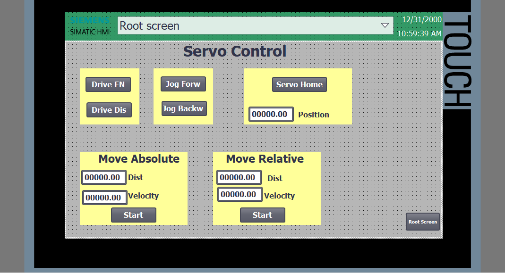
*Imagem 4 - TIA Portal*
  
  

*Imagem 5 - HMI*
  
Nas imagens 5 e 6 podemos observar que conteem 6 blocos, na qual dois deles sao iguais aos blocos das imagens 3 e 4. Os restantes 4 blocos , tem um icone, nomeado de Start, e se o utilizador pressionar, a estacao 10 ira movimentar-se ate a estacao que o bloco indica.
No canto inferior direito encontra-se um icone, que se o utilizador pressionar, ele direciona-se para outro ecra.
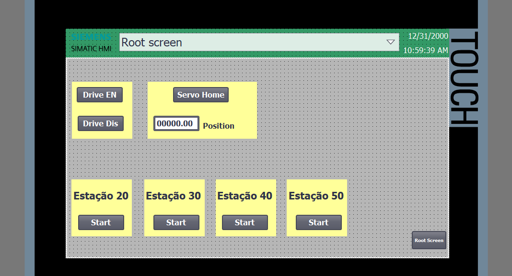
*Imagem 6 - TIA Portal*
  
  
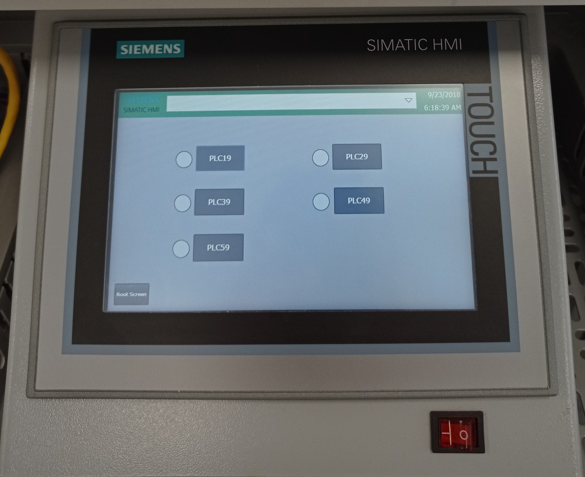
*Imagem 7 - HMI*
  
Nas imagens 7 e 8, encontra-se 5 blocos, cada um com o nome, que nos redireciona para outro ecra.
 No canto inferior esquerdo encontra-se um icone, que se o utilizador pressionar, ele direciona-se para outro ecra.
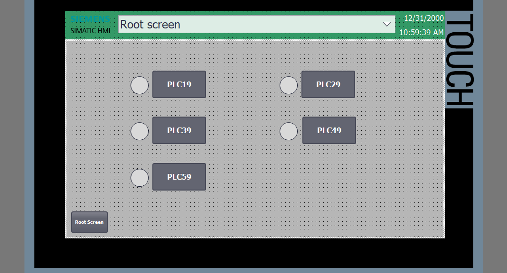
*Imagem 8 - TIA Portal*
  
  
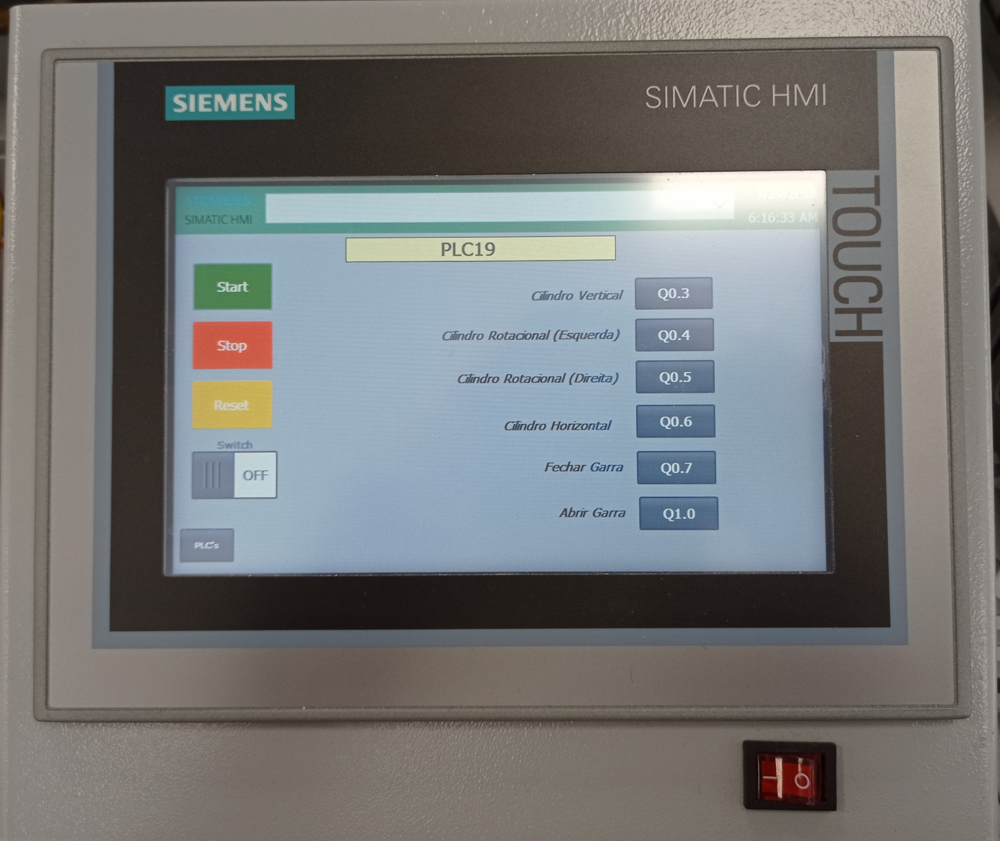
*Imagem 9 - HMI*
  
Nas imagens 9 e 10, observa-se varios icones com o objetivo de comandar manualmente e automaticamente na estacao 19, o icone *Start* faz com que a estacao faca o seu ciclo uma vez, em termos mais praticos da-se o nome de "Modo Ciclo", enquanto que mais abaixo temos um Switch ON/OFF que o objetivo e estar em modo automatico a estacao, ate receber uma ordem de paragem.
No canto inferior esquerdo encontra-se um icone, que se o utilizador pressionar, ele direciona-se para outro ecra.
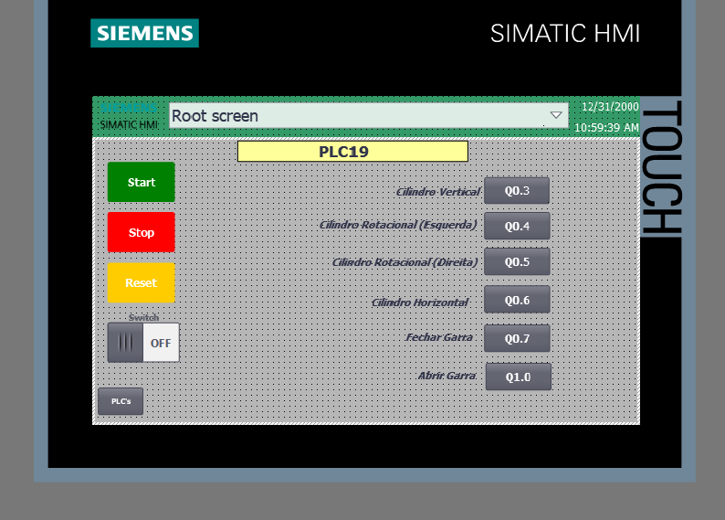

*Imagem 10 - TIA Portal*
  
  

*Imagem 11 - HMI*
  
Nas imagens 11 e 12, observa-se varios icones com o objetivo de comandar manualmente e automaticamente na estacao 29.
No canto inferior esquerdo encontra-se um icone, que se o utilizador pressionar, ele direciona-se para outro ecra.
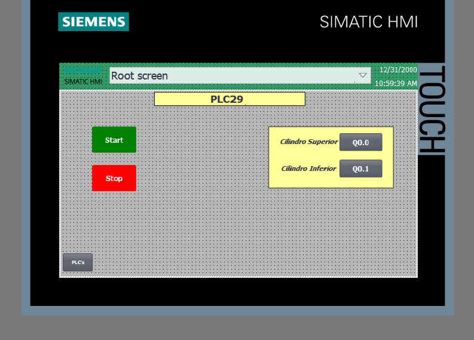

*Imagem 12 - TIA Portal*
  
  
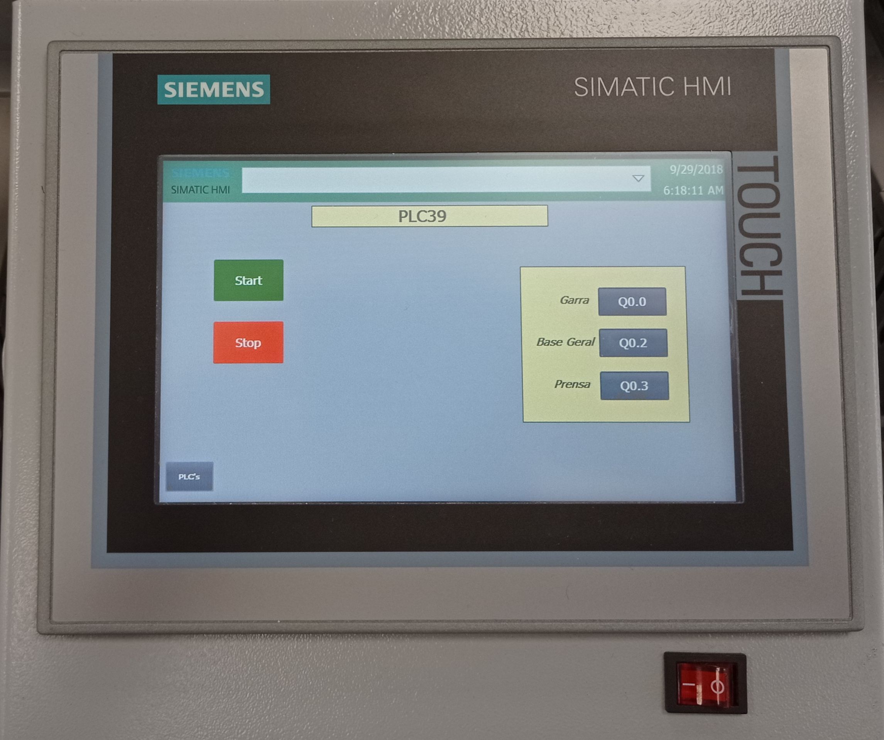
*Imagem 13 - HMI*
  
Nas imagens 13 e 14, observa-se varios icones com o objetivo de comandar manualmente e automaticamente na estacao 39.
No canto inferior esquerdo encontra-se um icone, que se o utilizador pressionar, ele direciona-se para outro ecra.
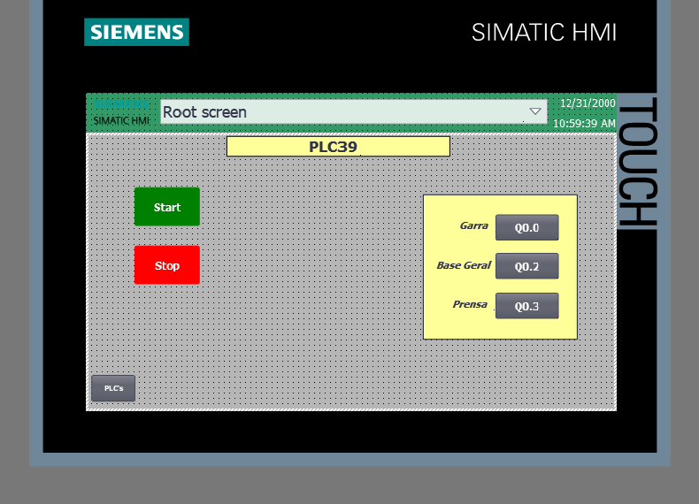

*Imagem 14 - TIA Portal*
  
  

*Imagem 15 - HMI*
  
Nas imagens 15 e 16, observa-se varios icones com o objetivo de comandar manualmente e automaticamente na estacao 49.
No canto inferior esquerdo encontra-se um icone, que se o utilizador pressionar, ele direciona-se para outro ecra.
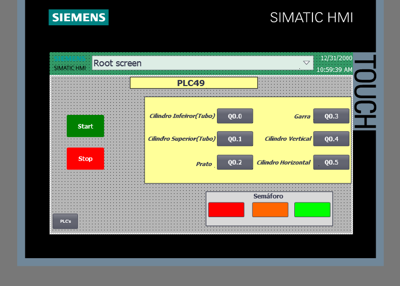

*Imagem 16 - TIA Portal*
  
  
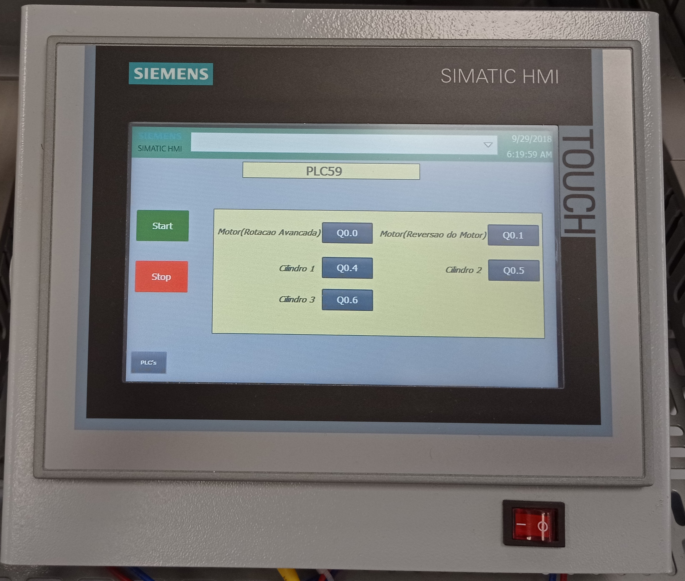
*Imagem 17 - HMI*
  
Nas imagens 17 e 18, observa-se varios icones com o objetivo de comandar manualmente e automaticamente na estacao 59.
No canto inferior esquerdo encontra-se um icone, que se o utilizador pressionar, ele direciona-se para outro ecra.
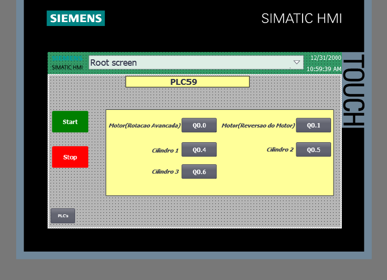

*Imagem 18 - TIA Portal*
  

### ***Manual***
#### **Fluxograma**
##### **Conceito**
  Um fluxograma é um diagrama que descreve um processo. É bastante utilizado em várias áreas para documentar, estudar, planear, melhorar e comunicar processos complexos por meio de diagramas claros e fáceis de entender. Nos Fluxogramas usa-se retângulos, ovais, diamantes e muitas outras formas para definir os tipos de passos, assim como setas conectoras para definir fluxo e sequência. Podem ser gráficos simples e desenhados à mão ou diagramas abrangentes desenhados por computador descrevendo as várias etapas e direcao. Os Fluxogramas também são conhecidos por nomes mais especializados, como fluxogramas de processo, mapas de processos, fluxogramas funcionais, notação de modelagem de processos de negócio ou diagramas de fluxo de processos.
   
 
##### **Simbologia**
  
Terminal

  
Processo

  
Seta de Fluxo

  
Decisão

  

Criar um ***fluxograma***

  
Em baixo têm uma figura com um exemplo de um fluxograma,onde pode observar que o objetivo é descobrir o porquê de um candeeiro não acender.
Interpreta-se da seguinte forma este ***Fluxograma***.
Se a lâmpada não tiver enroscada, irá enroscar a lâmpada para que o candeeiro acenda, caso isso não aconteça (sabe-se que a lâmpada está bem enroscada) teremos que ver a outra decisão, ver se a lâmpada está fundida. Se a lâmpada estiver fundida chegamos à conclusão que teremos que comprar um novo candeeiro.
  

#### ***Texto Estruturado***
 
#### **Passos**
  

#### 1 Passo
Começa-se por criar um novo bloco.

  

#### 2 Passo
De seguida, pressiona onde diz FC"Function"(Bloco verde) e seleciona a linguagem SCL

  

#### 3 Passo
Após o 2 passo deparasse com a janela do bloco criado, pronta a programar. 
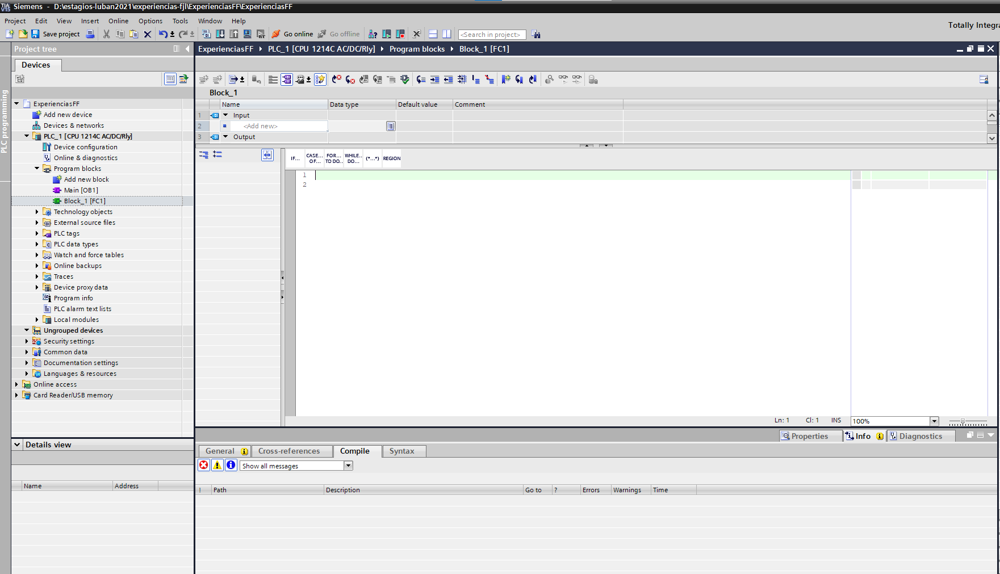
  

#### 4 Passo
Para criar as suas Tags, basta pressionar na seta direcionada para baixo e irá observar a página que estava minimizada.
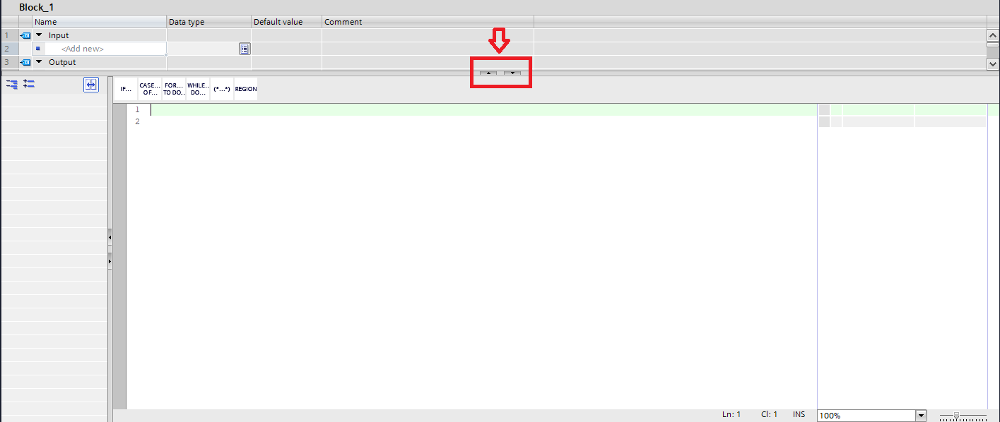
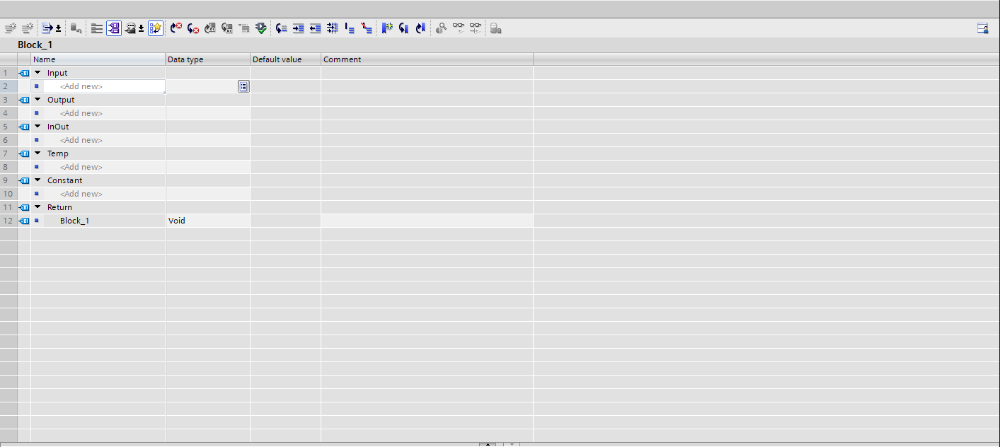
  

#### 5 Passo
Concluindo que têm, todos os passos anteriores completos,então poderá começar a fazer o texto estruturado.

  

