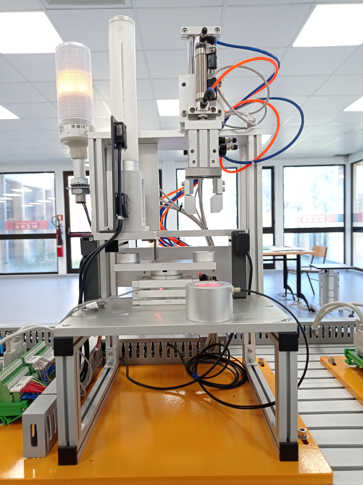
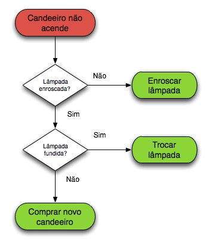
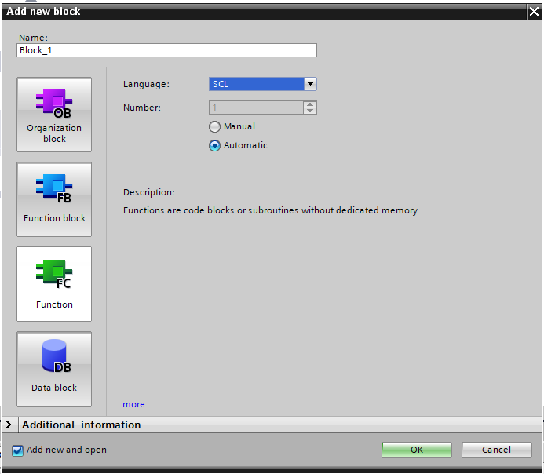

# Line 31

### **Indice**
- [**Introdução**](#introducao)
- [**Trabalho Realizado**](#trabalho-realizado)
   - [***Classificacao***](#Classificacao)
        - [Estação 10 ](#estacao-10)
        - [Estação 20 ](#estacao-20)
        - [Estação 30 ](#estacao-30) 
        - [Estação 40 ](#estacao-40)
        - [Estação 50 ](#estacao-50)
   - [***Grafcets***](#grafcets)
        - [Estação 10 Grafcet ](#estacao-10-Grafcet)
        - [Estação 20 Grafcet ](#estacao-20-Grafcet)
        - [Estação 30 Grafcet ](#estacao-30-Grafcet) 
        - [Estação 40 Grafcet ](#estacao-40-Grafcet)
        - [Estação 50 Grafcet ](#estacao-50-Grafcet)     
   - [***Fluxograma***](#Fluxograma)
   - [***Processo***](#Processo)
   - [***Manual***](#Manual)
        - [**Fluxograma**](#Fluxograma)
          - [Conceito ](#Conceito)
          - [Simbologia ](#Simbologia)  
          - [Criar um Fluxograma ](#Criar-um-Fluxograma)
        - [**Texto Estruturado** ](#Texto-Estruturado)
          - [Passos ](#Passos)

        
   
### Introdução

A Line 31 é uma das Lines do Grupo 30. Dividida em 5 estações das quais resultam: **"Transporte"**,**"Pressurização"**, **"Alimentação (Corpo e Miolo)"** e **"Seleção"**.

### Trabalho Realizado
#### Classificacao
  

#### Estacao 10 

|Tags                     |Inputs|Legend                     |Tags            |	Outputs|	Legend  |
|-------------------------|------|---------------------------|----------------|--------|----------|
|Axis_1_Homing_switch     |I0.0  |                           |Axis_1_Pulse    |Q0.0|		        |
|Axis_1_HighHw_LimitSwitch|I0.1  |Fim de Curso(Frente)       |Axis_1_Direction|Q0.1|		        |
|Axis_1_LowHw_LimitSwitch |I0.2  |Fim de Curso(Tras)           |3110Y10         |Q0.3|Cilindro Vertical|	
|311010B10                |I0.3  |Sensor de Movimento(Baixo) |3110Y20A        |Q0.4|Cilindro Rotacional(Esquerda)|	
|311010B11                |I0.4  |Sensor de Movimento(Cima)  |3110Y20B        |Q0.5|Cilindro Rotacional(Direita)|	
|311020B20                |I0.5  |Sensor de Rotacao(Esquerda)|3110Y30         |Q0.6|Cilindro Horizontal|	
|311020B21                |I0.6  |Sensor de Rotacao(Direita) |3110GA          |Q0.7|Fechar Garra|	
|311030B10                |I0.7  |Sensor de Posicao Avancada |3110GB          |Q1.0|	Abrir Garra|	
|311030B11                |I1.0  |Sensor de Posicao Recuada |31192011         |Q8.5|	Luz Laranja|
|3110G10                  |I1.1  |Sensor de Garra           |31192012         |Q8.6|Luz Verde|	
|311920SB2                |I8.4  |Stop                      |31192013         |Q8.7|Luz Vermelha|	
|311920SB1                |I8.5  |Start                     |			   	   	           
|311920QS                 |I8.6  |Switch de Emergência      |			   	               
|311920SA                 |I8.7  |Switch ON/OFF             |                                
  

#### Estacao 20 	

|Tags   |Inputs|	Legend          |		Tags|	Outputs|	Legend       |
|-------|------|--------------------|-----------|----------|-----------------|
|3120B21|I0.0  |Sensor de frente	|3120Y20    |Q0.0	   |Cilindro Superior|	
|3120B22|I0.1  |Sensor de Trás	    |3120Y10    |Q0.1	   |Cilindro Inferior|	
|3120B11|I0.2  |Sensor de Frente	|292011	    |Q0.7	   |Luz Laranja|	
|3120B12|I0.3  |Sensor de Trás	    |292012	    |Q1.0	   |Luz Verde|	
|3120B40|I0.4  |Sensor Base		    |292013	    |Q1.1	   |Luz Vermelha|	
|3120B31|I0.5  |Sensor de Cima(Tubo)					
|3120B32|I0.6  |Sensor de Baixo(Tubo)					
|3120B33|I0.7  |Sensor Metálico(Tubo)					
|3129SB2|I1.2  |Stop					
|3129SB1|I1.3  |Start					
|3129QS	|I1.4  |Switch de Emergência					
|3120SA	|I1.5  |Switch ON/OFF					
  

#### Estacao 30

|Tags	|Inputs|Legend		            |Tags  |Outputs|Lengend|
|-------|--------|------------------------|------|-------|-------------|	
|3130B21|I0.0	|Sensor Garra		      |3130Y20|Q0.0	  |Garra        |	
|3130B22|I0.1	|Sensor Garra Fechada     |3130Y10|Q0.2	  |Base         |	
|3130B11|I0.2	|Sensor de Trás (Base)    |3130Y30|Q0.3	  |Prensa       |	
|3130B12|I0.3	|Sensor de Frente(Base)   |392011 |Q0.7	  |Luz Laranja  |	
|3130B31|I0.4	|Sensor de Pos.Rec(Prensa)|392012 |Q1.0	  |Luz Verde    |	
|3130B32|I0.5	|Sensor de Pos.Av(Prensa) |392013 |Q1.1	  |Luz Vermelha |	
|3139SB2|I1.2	|Stop				 |	
|3139SB1|I1.3	|Start				 |	
|3139QS	|I1.4	|Switch de Emergência|					
|3139SA	|I1.5	|Switch ON/OFF       |
  

#### Estacao 40

|Tags	   |Inputs|Legend		           |Tags	  |Outputs|Legend	       |
|-----------|------|------------------------|----------|-------|----------------|
|314020B11 |I0.0  |Sensor Tubo em cima     |314020Y10 |	Q0.0  |Cilindro Baixo do Tubo|	
|314020B10 |I0.1  |Sensor Tubo em baixo    |314020Y20 |	Q0.1  |Cilindro Cima do Tubo|	
|314010B31 |I0.2  |Sensor Prato lado Esq.  |314010R10 |	Q0.2  |Prato	        |
|314010B30 |I0.3  |Sensor Prato lado Dir.  |314030G10 |	Q0.3  |Garra           	|
|314010B10 |I0.4  |Sensor Tubo	           |314030Y20 |	Q0.4  |Cilindro Vertical|	
|314020B21 |I0.5  |Sensor á Frente         |314030Y10 |	Q0.5  |Cilindro         Horizontal|	
|314020B20 |I0.6  |Sensor a trás           |314040HL10|	Q0.6  |Semáforo Encarnado|	
|314020B30 |I0.7  |Sensor á Frente         |314040HL20|	Q0.7  |Semáforo Laranja	 |
|314020B31 |I1.0  |Sendor a trás           |314040HL30|	Q1.0  |Semáforo Verde	 |
|314010B20 |I1.1  |Sensor posição inicial  |4920HL1   |	Q8.5  |Luz Laranja	     |
|314030B21 |I1.2  |Sensor Mov.(Prato)      |4920HL2   |	Q8.6  |Luz Verde	     |
|314030B10 |I1.3  |Sensor Garra            |4920HL3   |	Q8.7  |Luz Vermelha	     |
|314930B41 |I1.4  |Sensor de Garra em baixo|					
|314030B40 |I1.5  |Sensor de Garra em cima |					
|314030B51 |I8.0  |Sensor de Trás          |					
|314030B50 |I8.1  |Sensor de Frente        |					
|3149SB1   |I8.5  |Start                   |					
|3149QS    |I8.6  |Switch de Emerg.        |					
|3149SA    |I8.7  |Switch ON/OFF           |
  

#### Estacao 50

|Tags	|Inputs	|Legend		       |Tags	|Outputs|Legend|
|--------|-------|------------------|------- |-------|------------------------|
|       |I0.0	|Encoder(Fase A)   |Tapete	|Q0.0	|Motor (Rotação Avancada)|
|       |I0.1	|Encoder(Fase B)   |Tapete	|Q0.1	|Motor (Rotação Recuada) |	
|       |I0.2	|Encoder(Fase C)   |3150Y20	|Q0.4	|Cilindro 1|
|3150B11|I0.3	|Sensor de Material|3150Y30	|Q0.5	|Cilindro 2|
|3150B12|I0.4	|Sensor de Metálico|3150Y40	|Q0.6	|Cilindro 3|	
|3150B13|I0.5	|Sensor Otico      |592011  |Q0.7   |Luz Amarela |
|3150B21|I0.7   |Sensor(Cilindro 1)|592012  |Q1.0   |Luz Verde  |
|3150B31|I1.0   |Sensor(Cilindro 2)|592013  |Q1.1   |Luz Laranja|
|3150B41|I1.1   |Sensor(Cilindro 3)|
|3159SB2|I1.2	|Stop              |					
|3159SB1|I1.3	|Start	           |				
|3159QS	|I1.4	|Switch de Emerg.  |					
|3159SA	|I1.5	|Switch ON/OFF	   |
  

#### Fluxograma

##### Estacao 50

|Individual|		Junções	|		
|----------|-----------------|					
|Corpo Preto|Corpo Branco + Miolo Branco =11|			
|Corpo Branco|Corpo Branco + Miolo Preto =3	|		
|Miolo Preto|Corpo Branco + Miolo Metálico =15|			
|Miolo Branco|Corpo Preto + Miolo Branco =9	|		
|Corpo Plástico|Corpo Preto + Miolo Preto =1	|		
|Corpo Metálico|Corpo Preto + Miolo Metálico =13|			
|Miolo Plástico	|Corpo Metálico + Miolo Branco =12|			
|Miolo Metálico	|Corpo Metálico + Miolo Preto =4|			
|hhhhh|Corpo Metálico + Miolo Metálico =16	|		
  

### Grafcets 
#### Estação 10 

  

#### Estação 20

  

#### Estação 30

  

#### Estação 40

  

##### Estação 50
  

##### Com Rejeicao

  

##### Sem rejeicao

  

#### Fluxograma
  

##### Estação 50
###### Fluxograma Inteiro
.svg)
  

###### Fluxograma por Partes
.svg)
  

### Processo
##### Estacao 10

##### Estacao 20

  

##### Estacao 30

  

##### Estacao 40

  

##### Estacao 50

  

#####  Funcionamento Completo do Processo 

  

### ***Manual***
#### **Fluxograma**
##### **Conceito**
  Um fluxograma é um diagrama que descreve um processo. É bastante utilizado em várias áreas para documentar, estudar, planear, melhorar e comunicar processos complexos por meio de diagramas claros e fáceis de entender. Nos Fluxogramas usa-se retângulos, ovais, diamantes e muitas outras formas para definir os tipos de passos, assim como setas conectoras para definir fluxo e sequência. Podem ser gráficos simples e desenhados à mão ou diagramas abrangentes desenhados por computador descrevendo as várias etapas e direcao. Os Fluxogramas também são conhecidos por nomes mais especializados, como fluxogramas de processo, mapas de processos, fluxogramas funcionais, notação de modelagem de processos de negócio ou diagramas de fluxo de processos.
   
##### **Simbologia**
  
Terminal

  
Processo

  
Seta de Fluxo

  
Decisão

  
Criar um ***fluxograma***
  
Em baixo temos uma figura com um exemplo de um fluxograma,onde podemos observar que o objetivo é descobrir o porquê de um candeeiro não acender.
Interpreta-se da seguinte forma este ***Fluxograma***.
Se a lâmpada não tiver enroscada, iremos enroscar a lâmpada para que o candeeiro acenda, caso isso não aconteca(sabemos que a lâmpada está bem enroscada) teremos que ver a outra decisão, ver se a lâmpada esta fundida. Se a lâmpada estiver fundida chegamos à conclusão que teremos que comprar um novo candeeiro.
  

#### ***Texto Estruturado***
##### 
##### **Passos**
##### 1 Passo
Comecamos por criar um novo bloco.

##### 2 Passo
De seguida, pressionamos onde diz

##### 3 Passo
